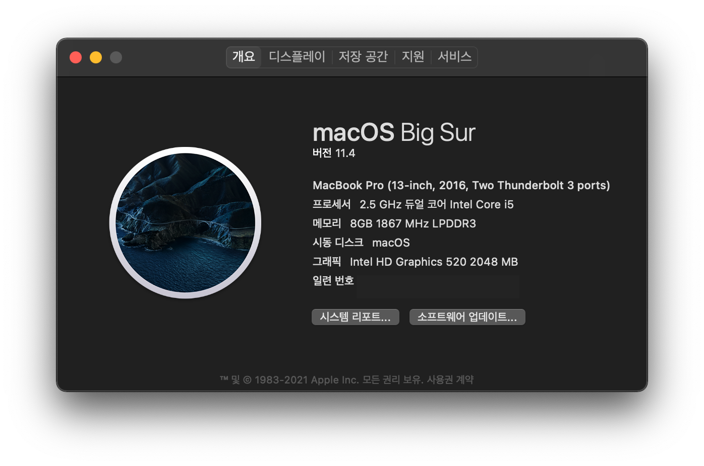

# OpenCore 0.7.0 for Surface Pro 4
## **Before use, MUST BE generating Platforminfo value!** Checkout [Information](#1.-Information)!

- [한국어](https://github.com/icaros7/OpenCore_Surface_Pro_4/blob/opencore-0.7.0/Readme_ko.md)
- English (This document)

# 1. Information
The laest version of OpenCore that based on OpenCore 0.7.0 & [@bigsadan's patched SSDT](https://github.com/bigsadan/surface-pro-4-hackintosh)

|✅ / ❌|Feature|Etc|
|:---:|:---|:---|
|❌|Wi-Fi / Bluetooth|No macOS driver for Marvell AVASTAR|
|❌|Touch Screen||
|❌|F/R Camera||
|❌|Stylus Pen||
|❌|External SD Card||
|✅|Audio|with mic|
|✅|Type Cover|with Multi-Touch Gesture|
|✅|Hardware Button|Thank you for @billabongbruno|

You can use this bootloader for hackintosh install & daily-use

**Please change serial number and UUID from `default value`** by way of SMBIOS Generator like [GenSMBIOS](https://github.com/corpnewt/GenSMBIOS). You can follow [this guide of OpenCore Official Guide](https://dortania.github.io/OpenCore-Install-Guide/config-laptop.plist/skylake.html#platforminfo).

# 2. Tested Environment
Successfully working following environment.

- macOS 11.4
- Surface Pro 4
    - i5 6300U
    - 8GB RAM
    - 256GB (Toshiba MLC)
- Multi-boot environment via rEFInd

# 3. Configuration
Include following configuration

- Default Language : Korean (You can choose other language at installation step)
- Default Keyboard Layout : Qwerty
- Boot Timeout: 5 Sec.
- Set Default: Enabled (`Ctrl + Enter` to set default)
- SecurityPolicy: Disabled
- Hide Auxiliary: Enabled (`Space Bar` to see that entry like recovery)
- Boot Verbose: Disable
- Apple Hot Key: Enable (`Cmd + V` to boot with Verse mode)
- MacBook Pro 13-Inch Late 2016 i5 non-Touchbar Model (`MacBookPro13,1`)
- Built in ACPIKeyboard.kext, CPUFriends.kext, USBInjectAll.kext, HibernationFixup.kext and USBMap.kext
- Set CPU power management option for Balanced Power Saving (Idle Clock 900Mhz) 

# 4. See Also
- [How to enable Secure Boot](https://github.com/badstorm/surface-pro-7-opencore/blob/master/SecureBoot.With.Grub.md) (Hide red bar on boot)

# 5. Special Thanks To
- [@acidanthera](https://github.com/acidanthera) - [OpenCorePkg](https://github.com/acidanthera/OpenCorePkg) and etc...
- [@bigsadan](https://github.com/bigsadan) - Offer patched SSDT for Surface
- [@billabongbruno](https://github.com/billabongbruno) - Fix hardware button (Pwr, Vol) [#3](https://github.com/icaros7/OpenCore_Surface_Pro_4/issues/3)