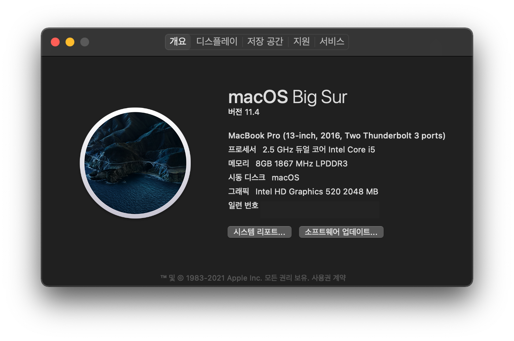

# OpenCore 0.7.0 for Surface Pro 4
## **사용전 꼭 Platforminfo 값 생성!** [안내](#1.-안내) 참조!

- 한국어 (이 문서)
- [English](https://github.com/icaros7/OpenCore_Surface_Pro_4)

# 1. 안내
OpenCore 0.7.0과 [@bigsadan 씨의 패치된 SSDT](https://github.com/bigsadan/surface-pro-4-hackintosh)를 기반으로 만들어진 최신 버전의 OpenCore 부트로더 입니다.

|✅ / ❌|기능|기타|
|:---:|:---|:---|
|❌|Wi-Fi / Bluetooth|Marvell AVASTAR 드라이버가 macOS에 없어 불가능|
|❌|터치 스크린||
|❌|전/후 카메라||
|❌|서피스 펜||
|❌|외장 SD카드||
|✅|오디오|마이크 가능|
|✅|타입 커버|멀티터치 제스처 포함|
|✅|하드웨어 버튼|@billabongbruno 제공|

Surface Pro 4 모델에 해킨토시 설치 및 실사용 가능 합니다.

**기본 시리얼 넘버 및 UUID가 `임의의 기본값`으로 설정** 되어있으므로 [GenSMBIOS](https://github.com/corpnewt/GenSMBIOS) 앱 등으로 생성 후 사용 가능 합니다. 제 블로그의 [이 글](https://minnote.net/해킨토시_hackintosh/Surface-Pro-4-Hackintosh/#6-1-모델-식별자-및-uuid-변경) 혹은 [오픈코어 공식 가이드](https://dortania.github.io/OpenCore-Install-Guide/config-laptop.plist/skylake.html#platforminfo)를 참조하시면 좋습니다.

# 2. 테스트 환경
다음과 같은 환경에서 테스트 되었습니다.

- macOS 11.4
- Surface Pro 4
    - i5 6300U
    - 8GB RAM
    - 256GB (도시바 MLC)
- rEFInd 를 통한 멀티 부트 환경

# 3. 설정
다음과 같은 설정을 포함하고 있습니다.

- 기본 언어: 한국어
- 기본 키보드 배열: 쿼티 (설치 과정 중에만 해당)
- 자동 부팅: 5초
- 자동 부팅 선택: 가능 (`Ctrl + 엔터`를 누를 경우 기본 값 설정)
- 보안 정책: 비활성화
- 기타 부트 옵션: 숨김 (`스페이스바`를 누를 경우 리커버리같은 해당 옵션 보기 가능)
- 부팅 Verbose: 비활성화
- 애플 단축키: 활성화 (`Cmd + V`를 누를 경우 Verse 모드로 부팅)
- MacBook Pro 13인치 논터치바 2016년 후기 기본형 모델 (`MacBookPro13,1`)
- ACPIKeyboard.kext, CPUFriends.kext, USBInjectAll.kext, HibernationFixup.kext, USBMap.kext 포함
- CPU 전력관리 옵션이 적절한 성능 및 배터리 절전을 기준으로 설정 (아이들링 클럭 900Mhz)

# 4. 참고
- [Secure Boot 사용하기 (영문)](https://github.com/badstorm/surface-pro-7-opencore/blob/master/SecureBoot.With.Grub.md)

# 5. Special Thanks To
- [@acidanthera](https://github.com/acidanthera) - [OpenCorePkg](https://github.com/acidanthera/OpenCorePkg) 및 기타 등등
- [@bigsadan](https://github.com/bigsadan) - Surface를 위한 패치된 SSDT 제공
- [@billabongbruno](https://github.com/billabongbruno) - 하드웨어 버튼 문제 해결 (Pwr, Vol) [#3](https://github.com/icaros7/OpenCore_Surface_Pro_4/issues/3)